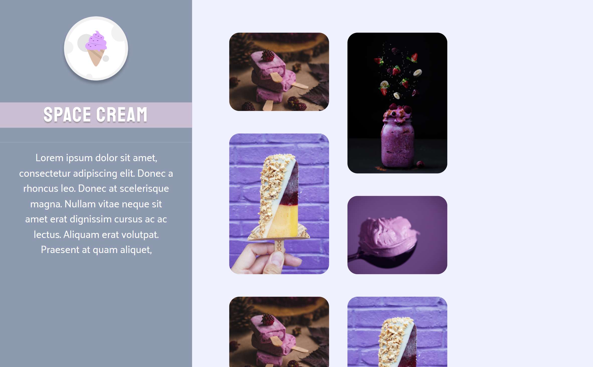

# Stage 3 - Challenge 4

>Explorer course

Project built on Rocketseat's Explorer course.

[ 🔗 Click here to access](https://ricardojcosta.github.io/explorer_stage3_desafio4/)

## ⚒ Technologies

  - HTML (semantic html)
  - CSS (responsiveness, effects)
  - Git and Github

## ✉ Contact

ricardoredes2006@gmail.com